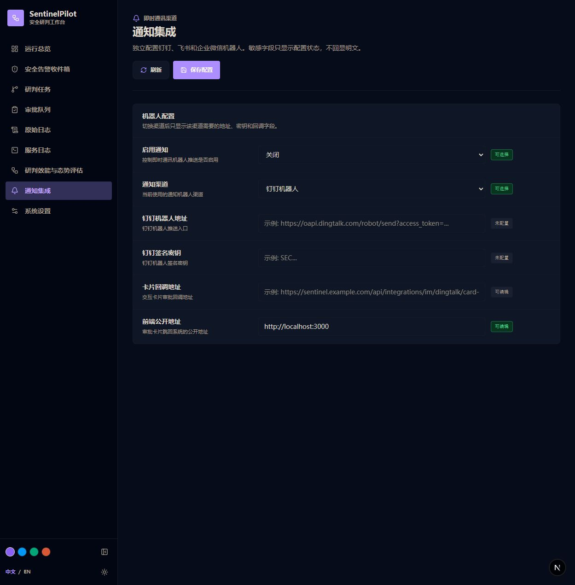
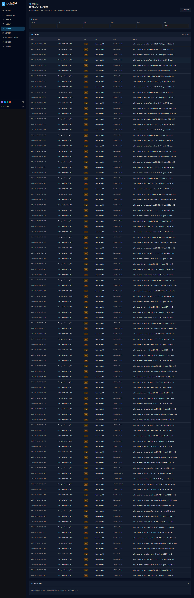
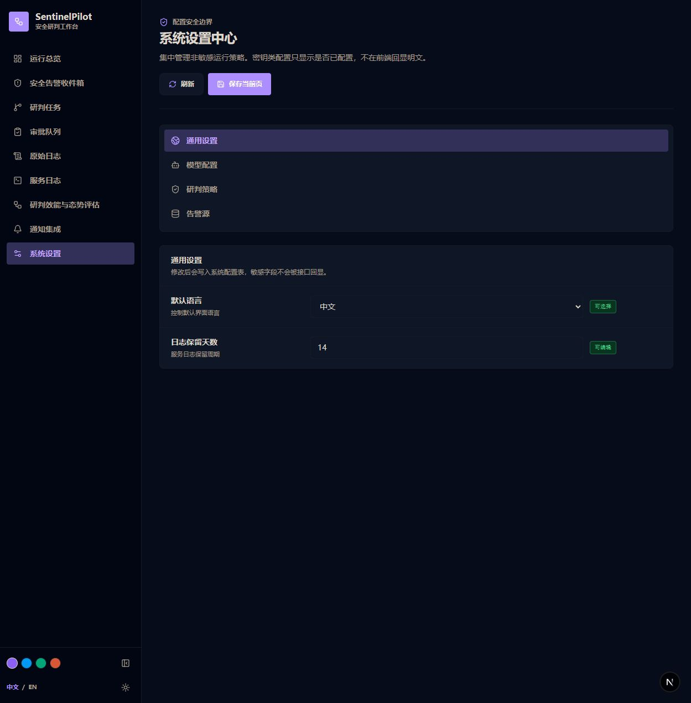
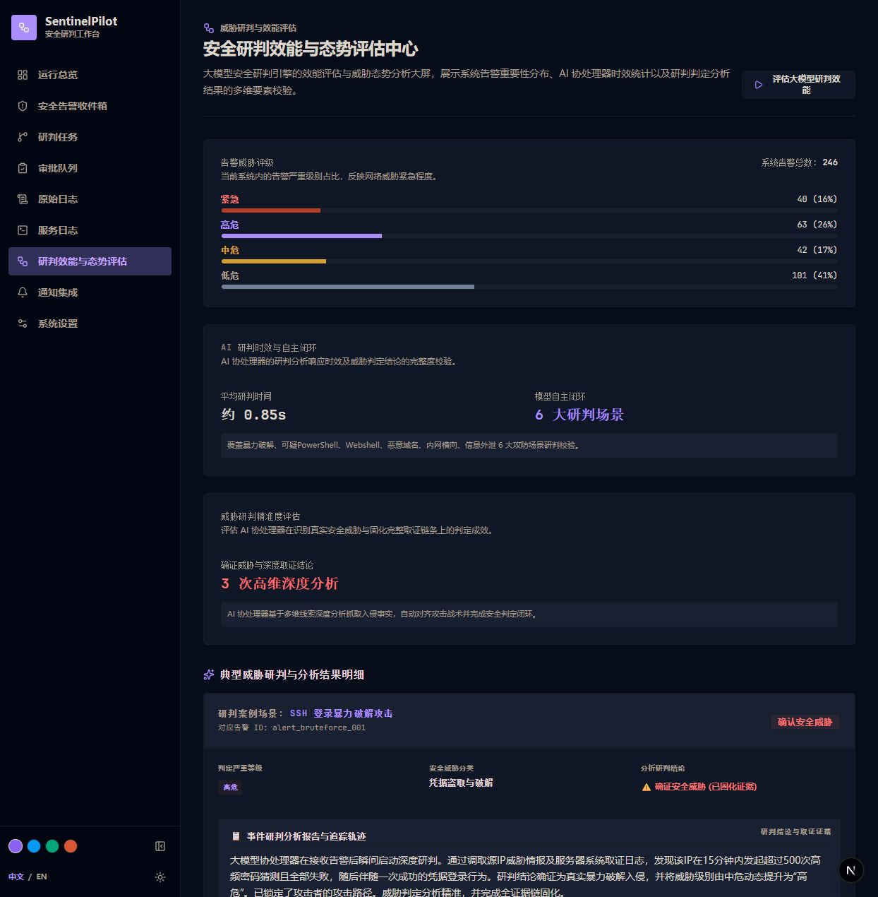

[English](./README.md) | [简体中文](./README.zh-CN.md)

# SentinelPilot

SentinelPilot is a local-first security alert investigation workspace. It normalizes security alerts, runs deterministic investigation workflows, records evidence and approvals, generates Markdown incident reports, and exposes a polished operations console for SOC-style review.

## Screenshots








## Current Capabilities

- **Operations Console**: resizable/collapsible navigation, multi-accent light/dark themes, health cards, metrics, high-risk queue, and recent investigation timeline.
- **Expanded Alert Catalog**: 6 hand-authored canonical alerts plus 240 deterministic expanded sample alerts for a realistic portfolio dataset.
- **Investigation Workflow**: deterministic tools for log search, threat-intel lookup, MITRE ATT&CK mapping, knowledge search, approval creation, and report generation.
- **Human Approval**: high-risk response actions create approval records only. Real blocking, host isolation, account disabling, and policy changes are not executed.
- **Settings Center**: database-backed editable runtime settings with masked secrets and provider-specific IM fields.
- **IM Robots**: DingTalk, Feishu, and WeCom robot configuration. DingTalk additionally supports interactive approval card callbacks.
- **Log Viewer**: raw security event search and service-log display from local files.
- **Eval Runner**: deterministic grading across the baseline attack cases.

## Technology Stack

- **Backend**: Python 3.11+, FastAPI, Pydantic v2, SQLite
- **Frontend**: Next.js 16, TypeScript, Tailwind CSS
- **Desktop Runtime**: Tauri 2 desktop shell, static Next.js export, Python FastAPI sidecar
- **Data**: local sample alerts, local JSONL telemetry, local SQLite

## Quick Start

### Local Development Backend

```powershell
cd backend
python -m venv .venv
.\.venv\Scripts\Activate.ps1
pip install -e .[dev]
python -m sentinel_pilot --host 127.0.0.1 --port 8000
```

### Local Development Frontend

```powershell
cd frontend
npm install
$env:NEXT_PUBLIC_API_BASE_URL="http://127.0.0.1:8000"
npm run dev
```

Open:

- Frontend: `http://localhost:3000`
- Backend docs: `http://localhost:8000/docs`
- Health check: `http://localhost:8000/health`

## Desktop Build

Windows:

```powershell
.\scripts\build-desktop.ps1
```

Linux:

```bash
bash scripts/build-desktop.sh
```

The scripts compile the FastAPI backend into a Tauri sidecar binary, export the Next.js UI to `frontend/out`, and then build the native installer. Windows outputs are created under `frontend/src-tauri/target/release/bundle/`.

## Verification

```powershell
cd backend
.\.venv\Scripts\python.exe -m pytest -q
.\.venv\Scripts\ruff.exe check .
```

```powershell
cd frontend
npm run lint
npm run build
npm run tauri:build
```

## Configuration

Copy `.env.example` to `.env` when you need local overrides. Keep real API keys, robot webhooks, and secrets in `.env` only. Runtime settings that are safe to edit from the UI are stored in the local `system_config` table and exposed through `/api/settings` with secret values masked.

In desktop mode the backend writes SQLite data and service logs to the operating system user data directory, not the installation directory. On Windows this resolves to `%APPDATA%\SentinelPilot`.

## Documentation

- [Architecture Guide](docs/architecture.md)
- [API Contract](docs/api-contract.md)
- [Desktop Packaging](docs/desktop-packaging.md)
- [Eval Report & Testing](docs/eval-report.md)
- [IM Integration](docs/im-integration.md)
- [Development Progress Plan](docs/development-progress-plan.zh-CN.md)
