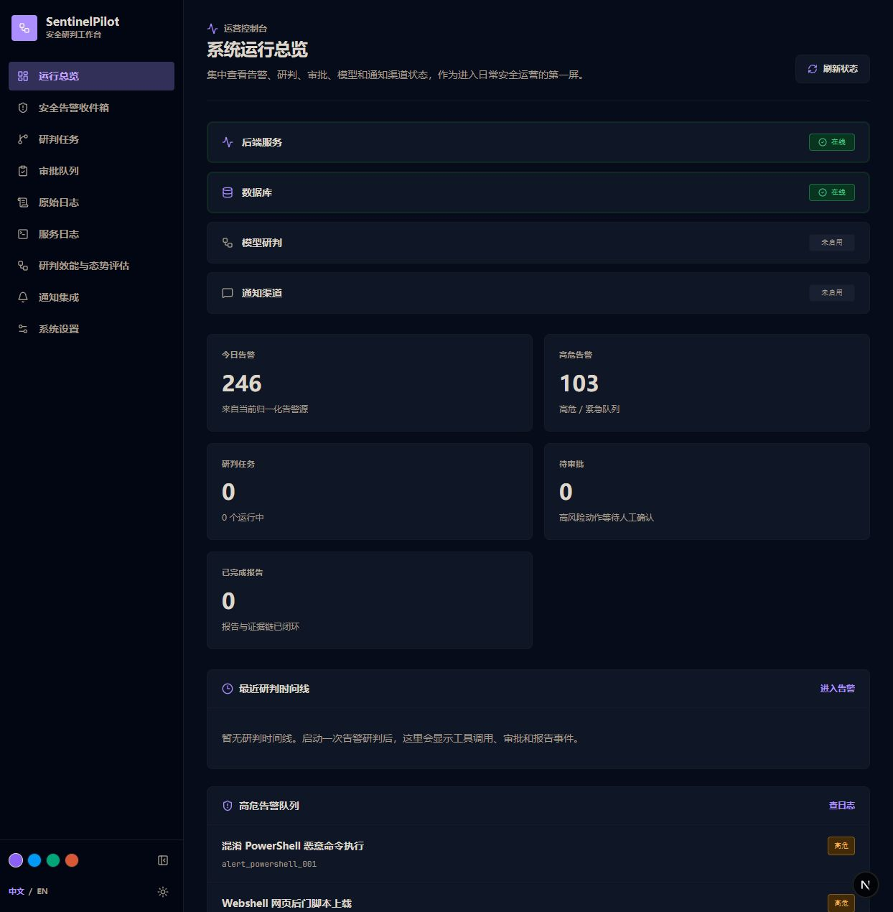
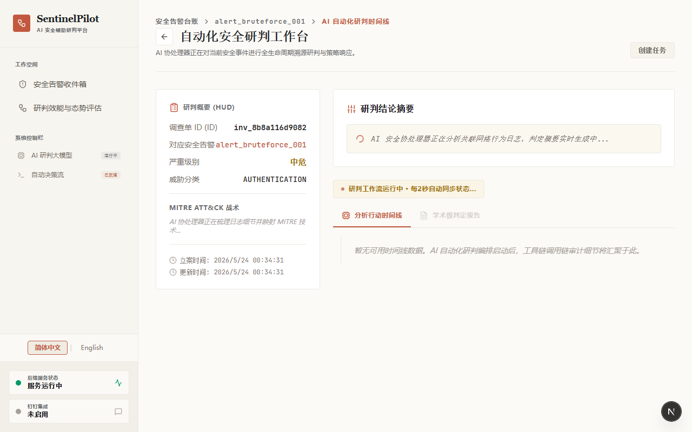

[English](./README.md) | [简体中文](./README.zh-CN.md)

# SentinelPilot

SentinelPilot 是一个自动化的安全告警响应与调查 Agent 平台。它接收来自各类安全设备的告警，将其标准化为统一格式，利用 AI 和安全工具编排调查工作流，管理人工介入（Human-in-the-loop）审批，并生成全面的 Markdown 格式事件报告。

## 项目截图




## 功能特性

- **告警标准化**: 统一 WAF、IPS、EDR、NDR、SIEM 等设备的告警格式。
- **自动化调查**: 使用确定性剧本和 Agent 工具（日志检索、威胁情报查询、MITRE ATT&CK 映射）。
- **人工审批流程**: 阻断 IP、隔离主机等高危响应动作会暂停并等待人工审批。
- **Markdown 事件报告**: 生成专业的学术级安全事件分析报告。
- **评测引擎 (Eval Runner)**: 内置自动化评估系统，持续针对多种网络攻击场景测试 Agent 的分析能力。
- **即时通讯 (IM) 集成**: 钉钉交互式审批卡片，并提供 Webhook 降级方案。

## 技术栈

- **后端**: Python 3.11+, FastAPI, Pydantic v2, SQLite
- **前端**: Next.js 14+, TypeScript, Tailwind CSS
- **流程编排**: 自研的确定性 Agent 工作流
- **部署方式**: 优先本地开发；可选 Docker Compose 部署。

## 快速开始 (本地开发)

主要开发路径是在宿主机上直接运行后端和前端。

### 后端

```powershell
cd backend
python -m venv .venv
.\.venv\Scripts\Activate.ps1
pip install -e .[dev]
uvicorn sentinel_pilot.main:app --reload --port 8000
```

### 前端

```powershell
cd frontend
npm install
npm run dev
```

打开浏览器访问：

- **前端工作台**: `http://localhost:3000`
- **后端 API 与文档**: `http://localhost:8000/docs`
- **健康检查**: `http://localhost:8000/health`

## 验证测试

在提交代码前，请运行以下命令进行验证：

```powershell
cd backend
.\.venv\Scripts\python.exe -m pytest -q
.\.venv\Scripts\ruff.exe check .
```

```powershell
cd frontend
npm run lint
npm run build
```

## 可选：Docker 部署

```bash
docker compose up -d --build
```

Docker 环境使用本地示例数据和一个命名的 SQLite 数据卷。这对于发布前的冒烟测试很有用，但日常开发应以本地启动为主。

## 钉钉配置

交互式卡片需要钉钉应用凭证、机器人 Code、开放群会话 ID、已发布的卡片模板 ID，以及一个可供钉钉访问的 Callback URL。请将这些值仅保存在本地的 `.env` 文件中；`.env.example` 中提供了占位符示例。

## 文档参考

- [架构指南](docs/architecture.md)
- [API 契约](docs/api-contract.md)
- [评测报告与测试](docs/eval-report.md)
- [IM 集成](docs/im-integration.md)
- [开发进度计划](docs/development-progress-plan.zh-CN.md)
