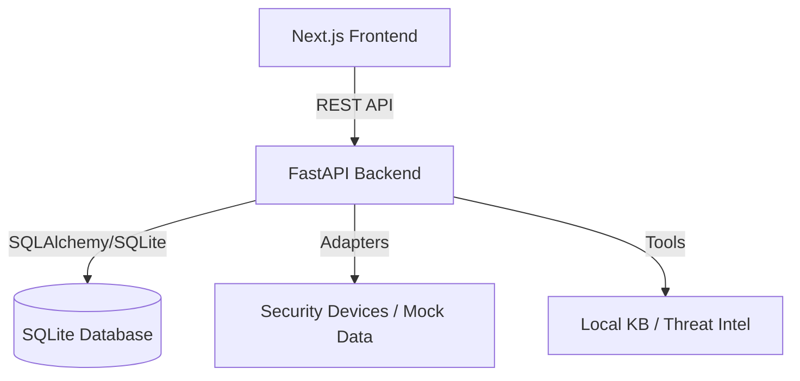

# Architecture

SentinelPilot is built using a modern decoupled architecture prioritizing reliability, auditability, and speed.

## High-Level Components

## Backend Modules

- **API Layer (`sentinel_pilot/api`)**: Fast and thin endpoints utilizing Pydantic for strict request/response validation.
- **Service Layer (`sentinel_pilot/services`)**: Business logic orchestration. Connects APIs to internal workflows (Investigations, Approvals, Reports).
- **Agent Orchestrator (`sentinel_pilot/agent/orchestrator.py`)**: The core workflow engine that processes alerts, runs tools sequentially, constructs semantic evidence, and decides risk levels.
- **Tool Registry (`sentinel_pilot/agent/tools.py`)**: A suite of deterministic tools including log searching, MITRE ATT&CK mapping, and knowledge base lookups.
- **Adapters (`sentinel_pilot/adapters`)**: Pluggable interfaces to normalize data from external vendor tools (currently uses `MockAlertSource` loaded from offline JSON).
- **Eval Runner (`sentinel_pilot/evals`)**: An integrated assessment framework for ensuring the Orchestrator generates the correct findings (Severity, Category, MITRE mapping) against a known set of attack datasets.

## Frontend Modules

- **Framework**: Next.js 14+ (App Router).
- **Styling**: Tailwind CSS with a "Minimalist Paper-and-Charcoal" aesthetic tailored for high-density SOC environments.
- **Data Fetching**: Native `fetch` with polling mechanisms for tracking investigation statuses in real-time.
- **Localization**: Pure frontend render-level mapping to seamlessly translate backend english payloads into professional localized Chinese SOC terminology.

## Database Schema (SQLite)

- **`investigations`**: Tracks the lifecycle status of an alert analysis (`created`, `running`, `waiting_approval`, `completed`).
- **`timeline_items`**: An append-only immutable ledger recording every step, tool invocation, and decision made by the agent.
- **`approvals`**: High-risk actions awaiting human confirmation.
- **`reports`**: The final rendered markdown deliverable.
