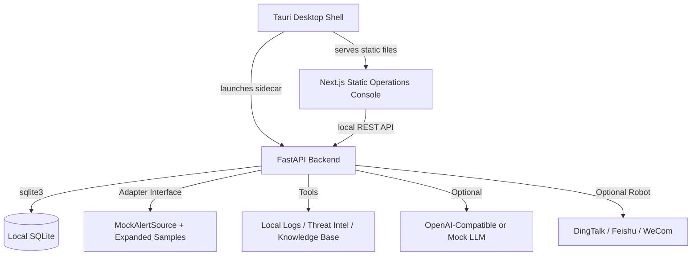

# Architecture

SentinelPilot is a local-first security operations workspace that can run either as a local development web app or as a bundled Tauri desktop app. The architecture favors deterministic behavior, auditability, masked configuration, and safe response simulation.

## High-Level Components

## Backend Modules

- **API Layer (`sentinel_pilot/api`)**: thin FastAPI endpoints with Pydantic request and response models.
- **Desktop Runtime (`sentinel_pilot/desktop_runtime.py`)**: command-line entrypoint that accepts the sidecar port and resolves user-data paths.
- **Service Layer (`sentinel_pilot/services`)**: investigation, approval, reporting, settings reload, and log access logic.
- **Agent Orchestrator (`sentinel_pilot/agent/orchestrator.py`)**: deterministic workflow engine that collects evidence, maps MITRE techniques, creates approvals, and writes the final investigation state.
- **Tool Registry (`sentinel_pilot/agent/tools.py`)**: local log search, threat-intel lookup, MITRE mapping, and knowledge-base search.
- **Adapters (`sentinel_pilot/adapters`)**: shared normalization interface. The current local source combines 6 canonical examples with 240 deterministic expanded sample alerts.
- **IM Integrations (`sentinel_pilot/integrations/im`)**: DingTalk, Feishu, and WeCom robot notification providers. DingTalk also supports interactive card approval callbacks.
- **Eval Runner (`sentinel_pilot/evals`)**: deterministic regression checks for severity, category, MITRE mapping, and tool execution.

## Frontend Modules

- **App Shell**: collapsible and resizable sidebar, first-level operations menu, language switcher, light/dark mode, and multiple accent palettes.
- **Operations Dashboard**: health cards, metrics, pending approval visibility, high-risk queue, and recent timeline events.
- **Alert Console**: high-density alert table and investigation entry points.
- **Log Explorer**: raw security telemetry search plus service-log display.
- **Settings Center**: database-backed runtime configuration with provider-specific fields and masked secrets.
- **Localization**: render-level Chinese/English mapping. Original security telemetry can remain raw evidence, but UI labels and state text must stay consistently localized.

## Desktop Runtime

- `frontend/src-tauri` contains the Rust desktop shell.
- Tauri launches the compiled FastAPI sidecar on a free local port and exposes the backend URL to the WebView through `backend_base_url`.
- Next.js exports static assets to `frontend/out`; unsupported dynamic path pages are represented by query-string detail routes.
- The backend writes SQLite and service logs to the OS user data directory, preserving data across reinstall or upgrade.
- The Tauri close path kills the backend sidecar process tree to avoid leftover local processes.

## Database Schema

- **`investigations`**: investigation lifecycle state and final classification.
- **`timeline_items`**: append-only investigation ledger for tool calls, findings, approvals, and reports.
- **`approvals`**: pending and decided high-risk action approvals.
- **`reports`**: generated Markdown incident reports.
- **`system_config`**: local editable runtime settings. Sensitive values are stored locally and masked in API responses.
- **`audit_log`**: reserved audit trail table for future settings and operator action history.

## Safety Boundary

SentinelPilot does not execute real blocking, host isolation, user disabling, file deletion, or security policy changes. High-risk response paths create approval records or simulated execution records only.
